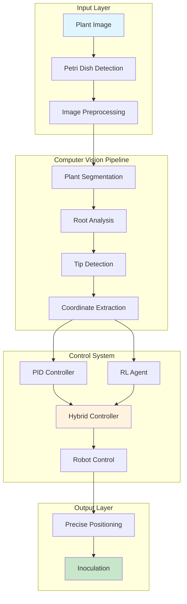
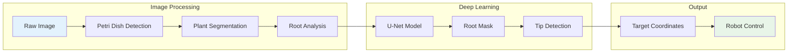
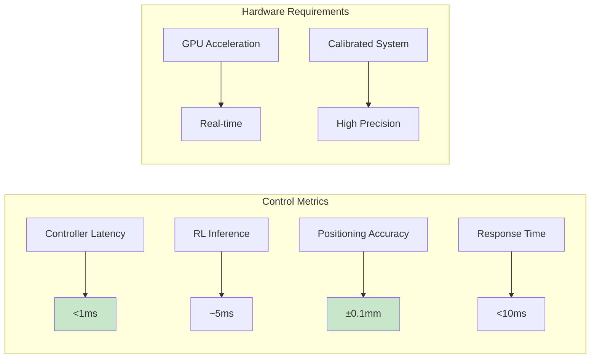

# Plant Inoculation Robot

<div align="center">

[](https://www.python.org/downloads/)
[](https://opensource.org/licenses/MIT)
[](https://python-poetry.org/)
[](https://github.com/psf/black)
[](https://www.docker.com/)
[](https://www.tensorflow.org/install/gpu)

**Automated plant root inoculation system combining computer vision, deep learning, and robotics for precise root tip targeting.**


[Quick Start](#quick-start) • [Documentation](#documentation) • [Features](#features) • [Development](#development) • [Performance](#performance)

</div>

## Overview

Plant Inoculation Robot is a solution to automate the process of inoculating plant root tips with high precision. The system integrates computer vision algorithms, deep learning models, and robotic control systems to achieve sub-millimeter accuracy in root tip targeting.


## System Architecture



## Quick Start

### Installation

```bash
# Clone the repository
git clone https://github.com/your-org/plant-inoculation-ai.git
cd plant-inoculation-ai

# Install with Poetry (recommended)
poetry install

# For GPU acceleration
poetry install --extras gpu

# For development environment
poetry install --extras all
```

### Basic Usage

```python
import numpy as np
from plant_inoculation_ai import CVPipeline, PIDController

# Initialize computer vision pipeline
pipeline = CVPipeline(
    patch_size=960,
    model_weights_path="path/to/model.weights.h5"
)

# Process plant image and extract root tips
image_path = "plant_image.jpg"
results = pipeline.process_image(image_path)
root_tips = pipeline.get_root_tips_for_robotics(results)

# Initialize precision controller
controller = PIDController(
    kp=[1.0, 1.0, 1.0],  # Proportional gains [x, y, z]
    ki=[0.1, 0.1, 0.1],  # Integral gains
    kd=[0.05, 0.05, 0.05]  # Derivative gains
)

# Execute precise targeting
for target in root_tips:
    current_pos = np.array([0.0, 0.0, 0.15])
    target_pos = np.array([target['pixel_x'], target['pixel_y'], 0.2])
    
    # Compute control action
    action = controller.compute(current_pos, target_pos, dt=1/240)
    
    # Apply to robot (implement your interface)
    robot.move(action)
```

## Features

### Computer Vision Pipeline



| Component | Technology | Performance |
|-----------|------------|-------------|
| **Petri Dish Detection** | OpenCV Contour Analysis | ~50ms per image |
| **Plant Segmentation** | Traditional CV + Morphology | ~100ms per image |
| **Root Analysis** | U-Net + MobileNet | ~200ms per patch |
| **Tip Detection** | Skeletonization + Pathfinding | ~100ms per image |
| **End-to-End** | Optimized Pipeline | ~500ms per plant |

### Robotics & Control

- **PID Controllers**: Anti-windup protection with output saturation
- **Reinforcement Learning**: SAC algorithm for adaptive control
- **Hybrid Control**: Seamless PID + RL blending
- **Precision Targeting**: Sub-millimeter accuracy (±0.1mm)
- **Real-time Response**: <1ms controller latency

### Machine Learning


- **Custom U-Net**: MobileNet backbone with transfer learning
- **Multi-loss Optimization**: Dice + Focal + Tversky + Boundary losses
- **GPU Acceleration**: Mixed precision training support
- **Performance Monitoring**: Real-time metrics and visualization

## Package Architecture

```
src/plant_inoculation_ai/
├── computer_vision/          # CV pipeline and analysis
│   ├── petri_dish.py        # Petri dish detection
│   ├── segmentation.py      # Plant segmentation
│   └── root_analysis.py     # Root architecture analysis
├── models/                  # Deep learning models
│   └── unet.py             # U-Net implementation
├── robotics/               # Robot control systems
│   └── controllers/        # PID and RL controllers
│       └── pid.py         # PID controller implementation
├── pipeline/               # End-to-end workflows
│   └── cv_pipeline.py     # Integrated CV pipeline
├── data/                   # Data loading utilities
├── utils/                  # Helper functions
└── core/                   # Core configurations
```

## Performance Benchmarks

### Computer Vision Performance

| Operation | Time (ms) | Hardware | Notes |
|-----------|-----------|----------|-------|
| Petri Dish Detection | 50 | CPU | OpenCV optimized |
| U-Net Inference | 200 | GPU (RTX 3080) | 960×960 patch |
| Root Analysis | 100 | CPU | Skeletonization |
| End-to-End Pipeline | 500 | Mixed | Full plant processing |

### Robotics Control Performance



| Metric | Value | Conditions |
|--------|-------|------------|
| Controller Latency | <1ms | Real-time loop |
| RL Inference | ~5ms | GPU acceleration |
| Positioning Accuracy | ±0.1mm | Calibrated system |
| Response Time | <10ms | Target acquisition |

## Deployment

### Docker Containerization

```bash
# Build development environment
docker build -t plant-inoculation-ai:dev .

# Build production image
docker build --target production -t plant-inoculation-ai:prod .

# Run with GPU support
docker run --gpus all -it plant-inoculation-ai:dev

# Run Jupyter environment
docker run --gpus all -p 8888:8888 plant-inoculation-ai:dev jupyter lab
```

### Cloud Deployment


The package is designed for seamless cloud deployment with:
- **Security**: Non-root containers, dependency scanning
- **Scalability**: Multi-GPU support, load balancing ready
- **Monitoring**: Health checks, performance metrics
- **CI/CD**: Automated testing and deployment pipelines

## Development

### Development Environment Setup

```bash
# Install development dependencies
poetry install --with dev

# Setup pre-commit hooks
poetry run pre-commit install

# Run code quality checks
poetry run black src/ tests/
poetry run isort src/ tests/
poetry run flake8 src/ tests/
poetry run mypy src/
poetry run bandit -r src/
```

### Testing Framework

```bash
# Run comprehensive test suite
poetry run pytest

# Generate coverage report
poetry run pytest --cov=src --cov-report=html

# Run specific test categories
poetry run pytest -m "unit"           # Unit tests
poetry run pytest -m "integration"    # Integration tests
poetry run pytest -m "not slow"       # Skip slow tests
```

### Documentation

```bash
# Build Sphinx documentation
cd docs && poetry run sphinx-build -b html . _build/html

# Serve documentation locally
python -m http.server 8000 --directory _build/html
```

## GPU Support

### GPU Availability Check

```python
from plant_inoculation_ai.utils.gpu_utils import print_gpu_summary

# Comprehensive GPU information
print_gpu_summary()

# Get recommended configuration
config = get_recommended_gpu_config()
print(f"Recommended batch size: {config['batch_size_multiplier']}x")
```

### GPU Configuration

```python
from plant_inoculation_ai.utils.gpu_utils import (
    configure_tensorflow_gpu, 
    set_tensorflow_mixed_precision
)

# Configure TensorFlow GPU
configure_tensorflow_gpu(memory_growth=True)

# Enable mixed precision for faster training
set_tensorflow_mixed_precision(enabled=True)
```

## License

This project is licensed under the **MIT License** - see the [LICENSE](LICENSE) file for details.

