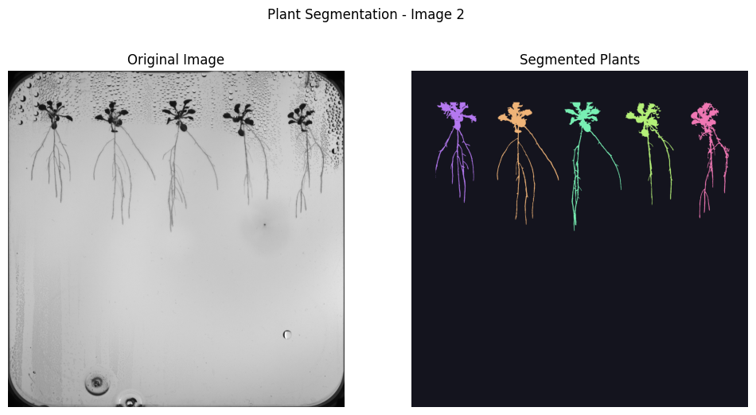
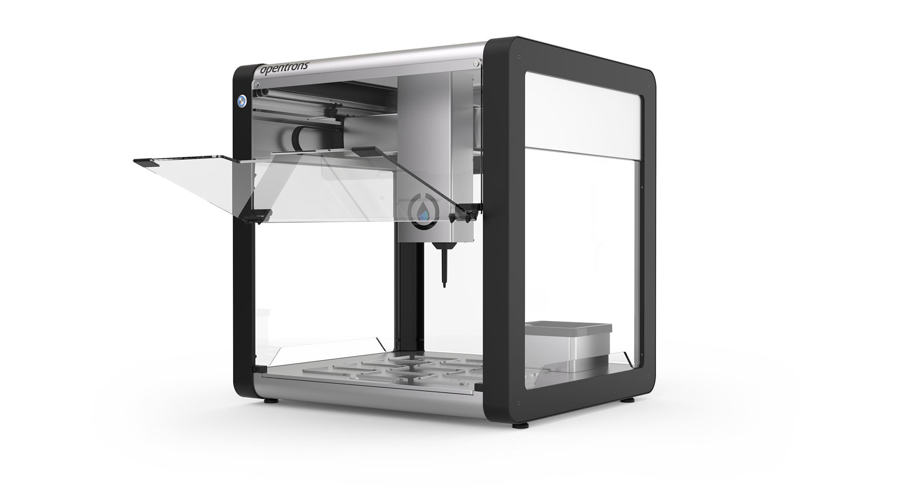
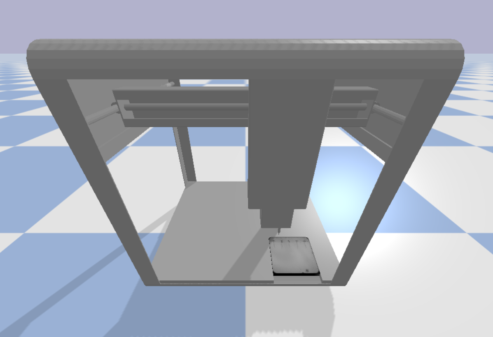

# Plant Inoculation AI System 🌱🤖

[](https://www.python.org)
[](https://pytorch.org)
[](https://opencv.org)
[](LICENSE)

<div align="center">
  <table>
    <tr>
      <td align="center" width="33%">
        
        <br>
        <em>Root System Analysis</em>
      </td>
      <td align="center" width="33%">
        
        <br>
        <em>Opentrons OT-2 Robot</em>
      </td>
      <td align="center" width="33%">
        
        <br>
        <em>Simulation Environment</em>
      </td>
    </tr>
  </table>
  
  *Automated system combining root image analysis and robotic precision for targeted plant inoculation.*
</div>

---

## 🎯 Overview
An advanced automated system that combines state-of-the-art computer vision and robotic control for precise plant root analysis and targeted inoculation. 


## 🌟 Key Features
- 🔬 Deep learning-based root segmentation
- 🎯 Instance segmentation for individual plant identification
- 🌿 Root System Architecture (RSA) extraction
- 🤖 Automated robotic control for precise inoculation
- 🔗 Integration with Opentrons OT-2 liquid handling robot

## 💫 Project Description
The system seamlessly processes images from NPEC's Hades system, capable of handling:
- 📊 Up to 10,000 seedlings
- 🔬 Over 2,000 Petri dishes
- 🔄 Automated processing pipeline
- 🎯 Precise inoculation targeting

## 🛠️ System Components

### 1. Computer Vision Pipeline 👁️

```mermaid
graph LR
    A[Image Input] --> B[Preprocessing]
    B --> C[Segmentation]
    C --> D[Root Analysis]
    D --> E[Measurements]
```

- 📸 Image preprocessing and Petri dish detection
- 🎯 Plant instance segmentation
- 🧠 Deep learning model for root segmentation
- 🌿 Root System Architecture extraction
- 📏 Primary root length measurement

### 2. Robotic Control System 🤖

```mermaid
graph LR
    A[Vision Output] --> B[Path Planning]
    B --> C[Control System]
    C --> D[Robot Execution]
```

- 💻 Opentrons OT-2 simulation environment
- 🎮 Gymnasium-compatible environment wrapper
- 🧠 Reinforcement Learning (RL) controller
- ⚙️ PID controller implementation
- 🔗 Vision-robotics integration

## 🚀 Getting Started

### Prerequisites
| Requirement | Version |
|------------|---------|
| Python     | 3.8+    |
| PyTorch    | Latest  |
| OpenCV     | Latest  |
| PyBullet   | Latest  |
| Gymnasium  | Latest  |
| Stable-Baselines3 | Latest |

### ⚡ Quick Start
1. Clone the repository:
   ```bash
   git clone https://github.com/yourusername/plant-inoculation-ai.git
   cd plant-inoculation-ai
   ```

2. Install dependencies:
   ```bash
   pip install -r requirements.txt
   ```

3. Run the setup script:
   ```bash
   python setup.py install
   ```

## 📚 Usage Examples

### 🖼️ Computer Vision Pipeline
```python
# Process a batch of images
from plant_inoculation import vision

# Initialize processor
processor = vision.ImageProcessor()

# Process images
results = processor.process_batch(
    input_dir="path/to/images",
    output_dir="path/to/output"
)
```

### 🤖 Robotics Control
```python
# Run the robotic controller
from plant_inoculation import robotics

# Initialize controller
controller = robotics.Controller(type="RL")

# Execute movement
controller.move_to_target([x, y, z])
```

## 📁 Project Structure
```
📦 plant-inoculation-ai
 ┣ 📂 computer_vision/
 ┃ ┣ 📂 preprocessing/
 ┃ ┣ 📂 segmentation/
 ┃ ┣ 📂 root_analysis/
 ┃ ┗ 📂 models/
 ┣ 📂 robotics/
 ┃ ┣ 📂 simulation/
 ┃ ┣ 📂 controllers/
 ┃ ┗ 📂 integration/
 ┣ 📂 data/
 ┃ ┣ 📂 raw/
 ┃ ┣ 📂 processed/
 ┃ ┗ 📂 models/
 ┗ 📂 utils/
```

## 🤝 Contributing
We welcome contributions! Please see our [Contributing Guidelines](CONTRIBUTING.md) for details.

## 📄 License
This project is licensed under the MIT License - see the [LICENSE](LICENSE) file for details.

## ✨ Acknowledgments
- 🏢 Netherlands Plant Eco-phenotyping Centre (NPEC)
- 👥 Project supervisors and mentors
- 🌟 Contributors and researchers

## 📞 Contact
For questions and support:
- 📧 Email: [contact@example.com](mailto:contact@example.com)
- 💬 Discord: [Join our community](https://discord.gg/example)
- 🌐 Website: [project-website.com](https://project-website.com)

---

<div align="center">
  <sub>Built with ❤️ by the Plant Inoculation AI Team</sub>
</div>